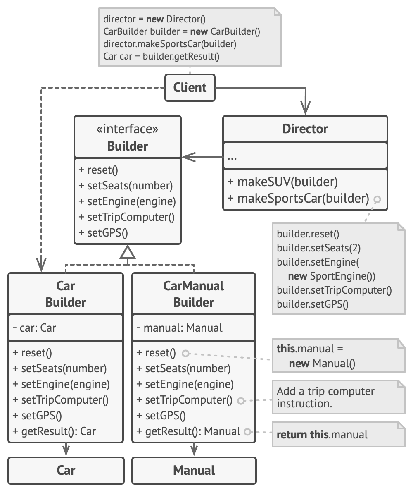

# 建構者模式 Builder Pattern

You can use Builder when creating complex Composite trees because you can program its construction steps to work
recursively. Builder focuses on constructing complex objects step by step.

You can combine Builder with Bridge: the director class plays the role of the abstraction, while different builders act
as implementations.

## 套路

ref:https://refactoring.guru/design-patterns

