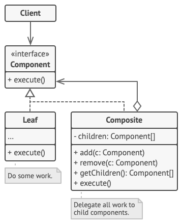

# 組合模式-Composite Pattern
- Use the Composite pattern when you have to implement a tree-like object structure.

- Use the pattern when you want the client code to treat both simple and complex elements uniformly.

> [color=#e50b00]
> A Decorator is like a Composite but only has one child component. 
> There’s another significant difference: Decorator adds additional responsibilities to the wrapped object, while Composite just “sums up” its children’s results.

## 套路

## cooperate with other Pattern

### Decorator
can use Decorator to extend the behavior of a specific object in the Composite tree.

### Iterators 

can use Iterators to traverse Composite trees.

### Flyweights 
can implement shared leaf nodes of the Composite tree as Flyweights to save some RAM.

### Visitor
can use Visitor to execute an operation over an entire Composite tree.

### Builder

can use Builder when creating complex Composite trees because you can program its construction steps to work recursively.

